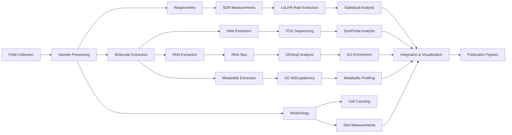
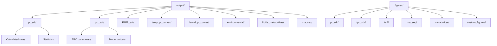

# Larval Symbiont Thermal Performance Curves (TPC)

## Project Overview

This repository contains data and analysis scripts from a comprehensive study investigating the effects of symbiont community identity on *Montipora capitata* coral larval thermal performance. The research was conducted in Hawaii during summer 2023 at the Hawaii Institute of Marine Biology (HIMB).

### Research Objectives

- Examine metabolic rates of coral larvae across different temperature regimes
- Investigate the role of symbiont identity (different *Symbiodiniaceae* species) on larval thermal tolerance
- Assess photosynthesis and respiration responses across thermal performance curves
- Characterize symbiont communities using ITS2 sequencing
- Analyze gene expression patterns under thermal stress using RNA-sequencing
- Evaluate metabolomic and lipidomic profiles of larvae under different conditions

---

## Repository Structure

```mermaid
graph TD
    A[larval_symbiont_TPC] --> B[data/]
    A --> C[scripts/]
    A --> D[output/]
    A --> E[figures/]
    A --> F[online_notebooks/]
    
    B --> B1[pr_sdr/]
    B --> B2[tpc_sdr/]
    B --> B3[its2/]
    B --> B4[rna_seq/]
    B --> B5[lipids_metabolites/]
    B --> B6[environmental/]
    B --> B7[sample_metadata/]
    B --> B8[F1F2_sdr/]
    B --> B9[larval_pi_curves/]
    B --> B10[temp_pi_curves/]
    B --> B11[phenoplate_oxygen/]
    B --> B12[size_cells/]
    B --> B13[fungia/]
    
    C --> C1[Respirometry Scripts]
    C --> C2[Molecular Analysis]
    C --> C3[Bioinformatics]
    C --> C4[Data Visualization]
    
    D --> D1[Processed Data]
    E --> E1[Publication Figures]
    F --> F1[Lab Notebooks]
```

---

## Data Types and Organization

### 1. **Respirometry Data** 

Oxygen flux measurements using Sensor Dish Reader (SDR) systems to quantify photosynthesis and respiration rates.

#### Photosynthesis-Respiration (PR) Measurements
- **Location**: `data/pr_sdr/`
- **Description**: Light-dark cycle measurements across different symbiont types and temperatures
- **Files**: 
  - `runs/`: Raw SDR data files (.csv)
  - `PR_SDR_Sample_Info.csv`: Sample metadata linking wells to larvae
  - `PR_SDR_Run_Info.csv`: Run conditions and timestamps
- **Analysis Scripts**: 
  - `scripts/larval_PR_sdr_extraction.Rmd`: Rate extraction using LoLinR
  - `scripts/larval_PR_sdr_analysis.Rmd`: Statistical analysis and visualization

#### Thermal Performance Curves (TPC)
- **Location**: `data/tpc_sdr/`
- **Description**: Metabolic rate measurements across temperature gradients
- **Files**: 
  - `runs/`: Raw SDR oxygen data across temperature treatments
  - `TPC_SDR_Sample_Info.csv`: Sample tracking information
- **Analysis Scripts**: 
  - `scripts/tpc_sdr_extraction.Rmd`: Extract metabolic rates
  - `scripts/tpc_sdr_analysis.Rmd`: TPC curve fitting and analysis

#### Temperature-Photosynthesis-Irradiance (PI) Curves
- **Location**: `data/temp_pi_curves/` and `data/larval_pi_curves/`
- **Description**: Photosynthesis responses to light intensity at different temperatures
- **Analysis Scripts**: 
  - `scripts/temp_PIcurve_sdr_extraction.Rmd`
  - `scripts/temp_PIcurve_sdr_analysis.Rmd`
  - `scripts/larval_pi_curve_sdr_extraction.Rmd`
  - `scripts/larval_pi_curve_sdr_analysis.Rmd`

#### F1/F2 Selective Breeding Study
- **Location**: `data/F1F2_sdr/`
- **Description**: Respirometry data from selectively bred coral lineages (F1 and F2 generations)
- **Analysis Scripts**: 
  - `scripts/F1F2_sdr_extraction.Rmd`
  - `scripts/F1F2_sdr_analysis.Rmd`

#### Additional Respirometry
- **Location**: `data/fungia/` and `data/phenoplate_oxygen/`
- **Description**: Comparative measurements from *Fungia* corals and phenoplate assays
- **Analysis Scripts**: 
  - `scripts/fungia_pr_sdr_extraction.Rmd`
  - `scripts/fungia_pr_sdr_analysis.Rmd`
  - `scripts/phenoplate_RLC_analysis.Rmd`
  - `scripts/phenoplate_light_dark_phases_analysis.Rmd`

### 2. **Molecular Data**

#### ITS2 Symbiont Community Analysis
- **Location**: `data/its2/`
- **Description**: Amplicon sequencing of ITS2 region to identify *Symbiodiniaceae* communities
- **Files**:
  - `symportal/`: SymPortal analysis outputs (DIV profiles and types)
  - `raw_QC/`: Quality control reports
  - `its2-sequencing-metadata.csv`: Sample metadata
  - `ITS2-sequencing.xlsx`: Sequencing run information
  - `SRA_metadata_acc_ITS2.xlsx`: NCBI SRA submission metadata
- **Analysis Scripts**: 
  - `scripts/its2.Rmd`: Diversity analysis, NMDS ordination, heatmaps

#### RNA-Sequencing (Transcriptomics)
- **Location**: `data/rna_seq/`
- **Description**: Gene expression profiling of larvae under thermal stress
- **Files**:
  - `Mcapitata2023_gene_count_matrix.csv`: Gene count matrix
  - `sample_rnaseq_metadata.csv`: Sample information
  - `QC/`: Quality control reports (FastQC, MultiQC)
  - `NCBI_upload/`: SRA submission files
  - `Montipora_capitata_HIv3.genes_fixed.gff3.zip`: Reference genome annotation
  - `rna-extraction-workbook.xlsx`: Extraction metadata
- **Analysis Scripts**: 
  - `scripts/rna-seq_DEG.Rmd`: Differential expression analysis
  - `scripts/rna-seq_functional_enrichment_goseq.Rmd`: GO enrichment with GOseq
  - `scripts/rna-seq_functional_enrichment_topGO.Rmd`: GO enrichment with topGO
- **Bioinformatics**: `scripts/bioinformatics/`: Quality control, trimming, alignment workflows

#### Metabolomics and Lipidomics
- **Location**: `data/lipids_metabolites/`
- **Description**: Small molecule and lipid profiling
- **Subdirectories**:
  - `metabolomics/`: GC-MS metabolite data
  - `lipidomics/`: Lipid profiles
  - `protein/`: Total protein quantification for normalization
  - `extractions/`: Extraction protocols and metadata
- **Analysis Scripts**: 
  - `scripts/metabolomics.Rmd`: Metabolite analysis
  - `scripts/lipidomics_area.Rmd`: Lipidomics data processing
  - `scripts/protein_omic_extractions.Rmd`: Protein normalization

### 3. **Environmental Data**

- **Location**: `data/environmental/`
- **Description**: Temperature, light, and water quality measurements during experiments
- **Analysis Scripts**: 
  - `scripts/logger_analysis.Rmd`: Environmental logger data processing
  - `scripts/daily_measurement_analysis.Rmd`: Daily monitoring data

### 4. **Morphological Data**

#### Cell Density and Size
- **Location**: `data/size_cells/`
- **Description**: Symbiont cell counts and size measurements
- **Analysis Scripts**: 
  - `scripts/cells_size.Rmd`: Cell density and size analysis

### 5. **Sample Metadata**

- **Location**: `data/sample_metadata/`
- **Description**: Central repository for sample tracking across all assays
- **Files**:
  - `MASTER_Hawaii2023_Sample_Inventory_20230630.xlsx`: Master sample inventory
  - `larval_incubation_sample_metadata.xlsx`: Experimental conditions
  - `spawning_fertilization_metadata.xlsx`: Spawning event information
  - `ITS2_sample_metadata.xlsx`: ITS2 sequencing samples
  - `cell_density_size_sample_metadata.xlsx`: Morphological samples
  - `SDR_QC.xlsx`: Respirometry quality control
  - `Tube_Box_Key.xlsx`: Sample storage locations

---

## Data Processing Workflow

---

## Analysis Scripts

### Respirometry Analysis
| Script | Purpose |
|--------|---------|
| `larval_PR_sdr_extraction.Rmd` | Extract O₂ rates from PR measurements |
| `larval_PR_sdr_analysis.Rmd` | Analyze PR data, create figures |
| `tpc_sdr_extraction.Rmd` | Extract rates from TPC experiments |
| `tpc_sdr_analysis.Rmd` | TPC curve fitting and thermal optima |
| `larval_pi_curve_sdr_extraction.Rmd` | Extract PI curve data |
| `larval_pi_curve_sdr_analysis.Rmd` | PI curve analysis |
| `temp_PIcurve_sdr_extraction.Rmd` | Temperature-specific PI curves |
| `temp_PIcurve_sdr_analysis.Rmd` | Temperature PI analysis |
| `F1F2_sdr_extraction.Rmd` | F1/F2 selective breeding data extraction |
| `F1F2_sdr_analysis.Rmd` | F1/F2 analysis |
| `fungia_pr_sdr_extraction.Rmd` | *Fungia* respirometry extraction |
| `fungia_pr_sdr_analysis.Rmd` | *Fungia* analysis |

### Molecular Analysis
| Script | Purpose |
|--------|---------|
| `its2.Rmd` | ITS2 diversity, ordination, visualization |
| `rna-seq_DEG.Rmd` | Differential gene expression with DESeq2 |
| `rna-seq_functional_enrichment_goseq.Rmd` | GO enrichment analysis (GOseq) |
| `rna-seq_functional_enrichment_topGO.Rmd` | GO enrichment analysis (topGO) |
| `metabolomics.Rmd` | Metabolite profiling and analysis |
| `lipidomics_area.Rmd` | Lipid profile analysis |
| `protein_omic_extractions.Rmd` | Protein quantification |

### Morphology and Environment
| Script | Purpose |
|--------|---------|
| `cells_size.Rmd` | Cell density and size analysis |
| `logger_analysis.Rmd` | Environmental logger data |
| `daily_measurement_analysis.Rmd` | Daily monitoring analysis |

### Bioinformatics
| Script | Purpose |
|--------|---------|
| `scripts/bioinformatics/2024-02-23-RNAseq-QC-for-Mcapitata-Larval-Thermal-Tolerance-Project.md` | RNA-seq QC pipeline |

---

## Output Directory Structure

---

## Key Experimental Conditions

### Symbiont Groups
- **Bleached (C)**: Larvae from bleached parent colonies (primarily *Cladocopium*)
- **Nonbleached (C/D)**: Larvae from resistant parent colonies (*Cladocopium* and *Durusdinium*)
- **Wildtype (C/D)**: Larvae from wild population

### Temperature Treatments
- **Ambient**: 27°C
- **Moderate**: +3°C (30°C)
- **High**: +6°C (33°C)
- **Extreme**: 36°C

### Light Levels (PAR)
- Dark: 0 PAR
- Low: 50 PAR
- Medium: 100 PAR
- High: 500 PAR

---

## Data Analysis Tools

### R Packages
- **Respirometry**: LoLinR, segmented
- **Statistics**: DESeq2, emmeans, car, vegan
- **Visualization**: ggplot2, ComplexHeatmap, cowplot
- **Phyloseq**: phyloseq, microViz (for ITS2 analysis)
- **Functional Enrichment**: goseq, topGO

### External Software
- **SymPortal**: ITS2 sequence analysis
- **FastQC/MultiQC**: Sequencing quality control
- **fastp**: Adapter trimming
- **STAR/HISAT2**: RNA-seq alignment

---

## Documentation and Lab Notebooks

The `online_notebooks/` directory contains detailed lab notebook entries documenting:
- Field collection procedures (spawning, fertilization)
- Sample extraction protocols (DNA, RNA, metabolites)
- Experimental setup and daily measurements
- Quality control assessments
- Data analysis workflows

Key notebook entries:
- `2023-06-15-Hawaii-2023-Coral-Spawning-and-Field-Expedition-Daily-Entry.md`: Daily field notes
- `2023-07-31-F1F2-project-data-analysis-Hawaii-2023.md`: F1/F2 project documentation
- Multiple extraction protocol entries for DNA/RNA preparations

---

## Citation and Data Availability

Data from this project has been deposited in public repositories:
- **RNA-seq data**: NCBI SRA (accession information in `data/rna_seq/NCBI_upload/`)
- **ITS2 sequences**: NCBI SRA (accession in `data/its2/SRA_metadata_acc_ITS2.xlsx`)

For more information, visit:
- [Putnam Lab GitHub](https://github.com/Putnam-Lab)
- [Coral Resilience Lab](https://www.coralresiliencelab.com/)

---

## Project Contributors

- Ariana S. Huffmyer
- Putnam Lab, University of Rhode Island
- Coral Resilience Lab, Hawaii Institute of Marine Biology

---

## License

This project data and code are available for research and educational purposes. Please cite appropriately when using this data.
